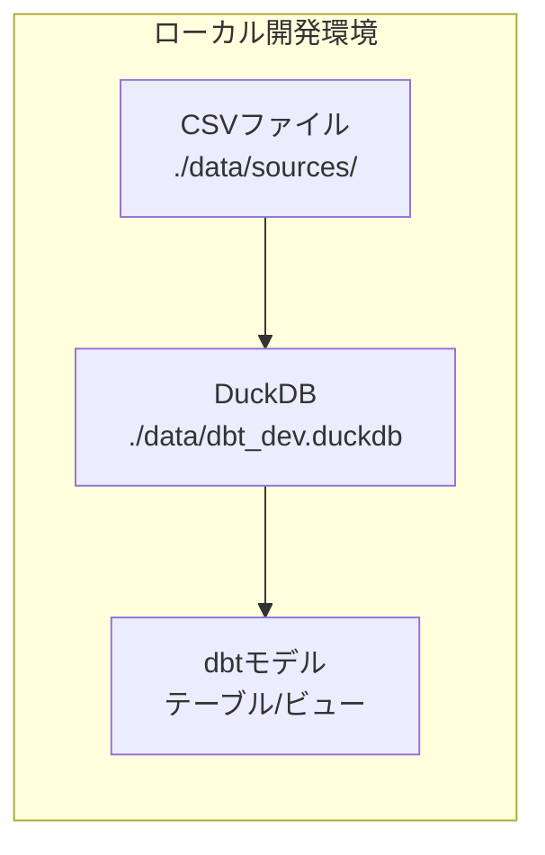
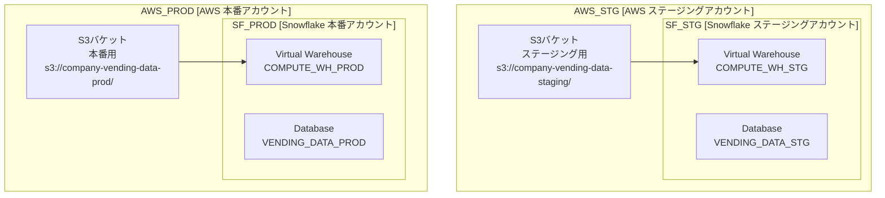
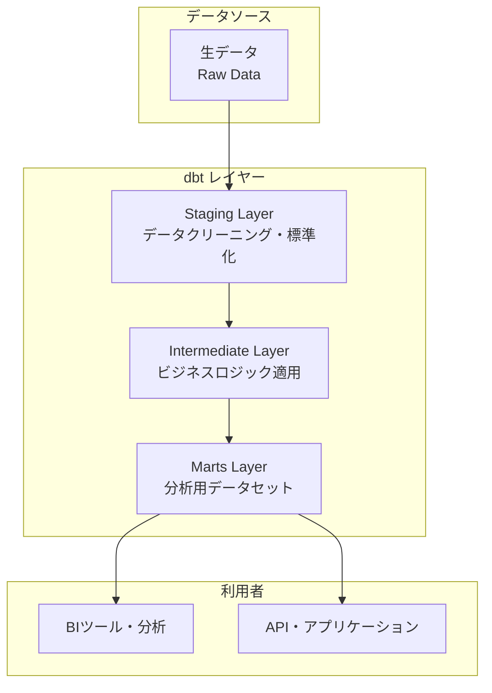
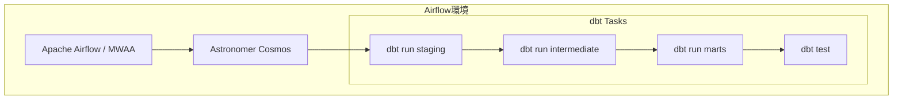

# アーキテクチャデザイン

## 概要

本ドキュメントは、my_claude_doc_investigationプロジェクトの全体アーキテクチャ設計について記載します。システムの構成要素、環境構成、データフロー、技術選定の詳細を定義します。

## 環境構成

### 環境概要

プロジェクトは以下の3つの環境で構成されます：

| 環境名 | 用途 | 説明 |
|--------|------|------|
| **開発環境（Development）** | 開発・検証 | 開発者が機能開発・テスト・検証を行う環境 |
| **ステージング環境（Staging）** | 統合テスト・受入テスト | 本番相当の環境でのテスト・品質確認 |
| **本番環境（Production）** | 本番運用 | 実際のビジネス運用で使用される環境 |

### 環境別特徴

#### 開発環境（Development）
- **目的**: 機能開発、単体テスト、開発者検証
- **インフラ**: ローカルPC
- **データ**: サンプルデータまたは匿名化データ
- **スケール**: 小規模、開発効率重視
- **アクセス**: 開発者のみ

#### ステージング環境（Staging）
- **目的**: 統合テスト、受入テスト、本番前検証
- **インフラ**: AWS（ステージング用アカウント）
- **データ**: 本番相当のデータ量（匿名化済み）
- **スケール**: 本番相当
- **アクセス**: 開発者、テスター、ビジネスユーザー

#### 本番環境（Production）
- **目的**: ビジネス本番運用
- **インフラ**: AWS（本番用アカウント）
- **データ**: 実データ
- **スケール**: 本番要件対応
- **アクセス**: 承認されたユーザーのみ

## インフラストラクチャ構成

### AWS アカウント分離

**セキュリティ原則**: 環境間の完全分離によるリスク管理

| 環境 | インフラ | アカウント分離の利点 |
|------|----------|---------------------|
| 開発 | ローカルPC | - コスト削減<br/>- 高速開発<br/>- ネットワーク分離 |
| ステージング | AWS（専用アカウント） | - 本番環境からの分離<br/>- テスト用リソース管理<br/>- コスト可視化 |
| 本番 | AWS（専用アカウント） | - 最高レベルのセキュリティ<br/>- 本番専用アクセス制御<br/>- 監査要件対応 |


## データストレージ設計

### 生データ保存場所

各環境での生データ保存先は以下の通りです：

| 環境 | 保存場所 | 詳細 |
|------|----------|------|
| **開発環境** | ローカルディスク | `./data/` ディレクトリ |
| **ステージング環境** | AWS S3 | 専用S3バケット（ステージング用アカウント） |
| **本番環境** | AWS S3 | 専用S3バケット（本番用アカウント） |

### ストレージ構成詳細

#### 開発環境（ローカル）
```
プロジェクトルート/
├── data/
│   ├── sources/                    # 生データ
│   │   ├── sales_VM001_20240315.csv
│   │   ├── vending_machines.csv
│   │   ├── products.csv
│   │   └── ...
│   ├── dbt_dev.duckdb             # DuckDBファイル
│   └── staging/                    # 中間ファイル
```

#### AWS環境（ステージング・本番）

**ステージング環境**:
```
s3://[company]-vending-data-staging/
├── raw-data/                       # 生データ
│   ├── sales/
│   │   ├── sales_VM001_20240315.csv
│   │   └── sales_VM002_20240315.csv
│   ├── replenishment/
│   │   └── replenishment_records_VM001_20240315.csv
│   └── master-data/
│       ├── vending_machines.csv
│       ├── products.csv
│       ├── product_categories.csv
│       ├── staff.csv
│       └── payment_methods.csv
├── processed-data/                 # 加工済みデータ
└── dbt-artifacts/                  # dbt実行結果
```

**本番環境**:
```
s3://[company]-vending-data-prod/
├── raw-data/                       # 生データ（同一構造）
├── processed-data/                 # 加工済みデータ
└── dbt-artifacts/                  # dbt実行結果
```

### データアクセスパターン

#### 開発環境
- **アクセス方法**: ローカルファイルシステム
- **データ同期**: 手動コピーまたはスクリプト
- **容量**: 開発に必要最小限

#### AWS環境

**ステージング環境**:
- **AWS アカウント**: 専用ステージングアカウント
- **S3バケット**: `s3://[company]-vending-data-staging/`
- **Snowflakeアカウント**: `[company-staging].snowflakecomputing.com`
- **データ同期**: S3 → Snowflake ステージング（毎日自動）

**本番環境**:
- **AWS アカウント**: 専用本番アカウント
- **S3バケット**: `s3://[company]-vending-data-prod/`
- **Snowflakeアカウント**: `[company-prod].snowflakecomputing.com`
- **データ同期**: S3 → Snowflake ステージング（毎日自動）

### セキュリティ考慮事項

| 環境 | セキュリティ対策 |
|------|------------------|
| 開発 | - ローカル暗号化<br/>- gitignore設定<br/>- サンプル/匿名化データのみ |
| ステージング | - S3暗号化（AES-256）<br/>- IAMアクセス制御<br/>- VPCエンドポイント |
| 本番 | - S3暗号化（KMS）<br/>- 厳格なIAMポリシー<br/>- アクセスログ監視<br/>- データ分類タグ |

## データ基盤設計

### 技術選定

各環境でのデータウェアハウス技術選定：

| 環境 | データ基盤 | 詳細 |
|------|------------|------|
| **開発環境** | DuckDB | ローカルファイルベース、高速開発 |
| **ステージング環境** | Snowflake | クラウドネイティブ（専用アカウント） |
| **本番環境** | Snowflake | クラウドネイティブ（専用アカウント） |

### データ基盤詳細設計

#### 開発環境（DuckDB）



**特徴**:
- **軽量**: 単一ファイルデータベース
- **高速**: メモリ最適化、列指向
- **開発効率**: セットアップ不要、即座にクエリ実行
- **コスト**: 完全無料

#### AWS環境（Snowflake）



**特徴**:
- **スケーラブル**: 自動スケーリング
- **完全分離**: AWS・Snowflake両方でアカウント分離
- **セキュリティ**: 環境間の物理的分離
- **パフォーマンス**: MPP（超並列処理）
- **運用**: フルマネージド


### データロード戦略

| 環境 | データロード方法 | 頻度 | S3バケット |
|------|------------------|------|------------|
| 開発 | ローカルCSV読み込み | 手動・必要時 | - |
| ステージング | S3 → Snowflakeステージング | 毎日（自動） | `s3://[company]-vending-data-staging/` |
| 本番 | S3 → Snowflakeステージング | 毎日（自動） | `s3://[company]-vending-data-prod/` |

### パフォーマンス・コスト考慮

#### 開発環境
- **メリット**: ゼロコスト、高速起動
- **制約**: メモリ・ディスク容量制限

#### Snowflake環境
- **メリット**: 無制限スケール、高可用性
- **コスト管理**: 
  - ステージング：小規模ウェアハウス
  - 本番：需要に応じたオートスケール
  - 使用時間課金による最適化

## データ取り込み設計

### オーケストレーション技術

各環境でのワークフロー管理技術：

| 環境 | オーケストレーション | 詳細 |
|------|---------------------|------|
| **開発環境** | Apache Airflow（ローカル） | ローカルマシン上で動作 |
| **ステージング環境** | AWS MWAA | マネージドAirflow（ステージング用アカウント） |
| **本番環境** | AWS MWAA | マネージドAirflow（本番用アカウント） |

### データ取り込みアーキテクチャ

```mermaid
graph TB
    subgraph "開発環境"
        CSV_LOCAL[ローカルCSVファイル<br/>./data/sources/] 
        AIRFLOW_LOCAL[Apache Airflow<br/>ローカル実行]
        DUCKDB[DuckDB<br/>Stagingレイヤー]
        
        CSV_LOCAL --> AIRFLOW_LOCAL
        AIRFLOW_LOCAL --> DUCKDB
    end
    
    subgraph "AWS_STG_ACCOUNT [AWS ステージング環境]"
        S3_STG_SRC[S3 生データ<br/>s3://company-vending-data-staging/raw-data/]
        MWAA_STG[AWS MWAA<br/>ステージング]
        SF_STG_STAGE[Snowflake Staging<br/>VENDING_DATA_STG.STAGING]
        
        S3_STG_SRC --> MWAA_STG
        MWAA_STG --> SF_STG_STAGE
    end
    
    subgraph "AWS_PROD_ACCOUNT [AWS 本番環境]"
        S3_PROD_SRC[S3 生データ<br/>s3://company-vending-data-prod/raw-data/]
        MWAA_PROD[AWS MWAA<br/>本番]
        SF_PROD_STAGE[Snowflake Staging<br/>VENDING_DATA_PROD.STAGING]
        
        S3_PROD_SRC --> MWAA_PROD
        MWAA_PROD --> SF_PROD_STAGE
    end
```



### 取り込みスケジュール

| 環境 | 実行頻度 | 実行時間 | トリガー |
|------|----------|----------|----------|
| 開発 | 手動実行 | 随時 | 開発者による実行 |
| ステージング | 毎日 | 01:00 UTC | MWAA自動実行 |
| 本番 | 毎日 | 02:00 UTC | MWAA自動実行 |

### エラーハンドリング・監視

#### 開発環境
- **ログ**: Airflowローカルログ
- **アラート**: ターミナル出力
- **リトライ**: 手動再実行

#### AWS環境（MWAA）
- **ログ**: CloudWatch Logs統合
- **アラート**: CloudWatch Alarms + SNS
- **リトライ**: 自動リトライ（3回）
- **監視**: Airflow UI + CloudWatch メトリクス

### セキュリティ考慮事項

| 環境 | 認証・認可 | 接続情報管理 |
|------|------------|-------------|
| 開発 | ローカル認証 | 環境変数・設定ファイル |
| ステージング | IAMロール | AWS Secrets Manager |
| 本番 | IAMロール | AWS Secrets Manager |

## データ変換設計

### dbtレイヤーアーキテクチャ

データ基盤上では、dbtベストプラクティスに従った3層のレイヤー構成を採用します：



### レイヤー別の役割

| レイヤー | 目的 | 処理内容 | マテリアライゼーション |
|----------|------|----------|------------------------|
| **Staging** | データクリーニング・標準化 | - 生データの取り込み<br/>- 型変換・命名規則統一<br/>- 基本的なデータ品質チェック | View（軽量処理） |
| **Intermediate** | ビジネスロジック適用 | - 複雑な計算・集計<br/>- テーブル結合<br/>- ビジネスルール適用 | View or Table（処理量に応じて） |
| **Marts** | 分析用データセット | - 最終的な分析データ<br/>- パフォーマンス最適化<br/>- エンドユーザー向け | Table（高速アクセス） |

### dbt実行基盤設計

#### Airflow + Cosmos統合

**Cosmos**は、Airflowでdbtプロジェクトを効率的に管理・実行するためのツールです。



### Cosmosの利点

| 機能 | 従来のAirflow | Cosmos使用時 |
|------|---------------|-------------|
| **dbt依存関係管理** | 手動でタスク依存関係を定義 | dbtの依存関係を自動検出・反映 |
| **DAG生成** | 個別にPythonOperator作成 | dbtプロジェクトから自動生成 |
| **テスト統合** | 別途テストタスク作成 | dbtテストを自動的に組み込み |
| **失敗時の処理** | 全体再実行 | 失敗したモデルのみ再実行 |
| **ログ管理** | Airflowログのみ | dbt詳細ログとの統合 |

### 環境別dbt実行設定

#### 開発環境
- **実行方式**: ローカルAirflow + Cosmos
- **対象**: 選択されたモデルのみ（開発効率重視）
- **並列度**: 2スレッド

#### ステージング環境  
- **実行方式**: MWAA + Cosmos
- **対象**: 全モデル（本番前検証）
- **並列度**: 4スレッド
- **スケジュール**: 毎日03:00 UTC（データ取り込み後）

#### 本番環境
- **実行方式**: MWAA + Cosmos  
- **対象**: 全モデル
- **並列度**: 8スレッド
- **スケジュール**: 毎日04:00 UTC（ステージング検証後）

### dbtワークフロー統合

```
データ取り込み（01:00-02:00）
         ↓
dbt staging（03:00-03:30）
         ↓  
dbt intermediate（03:30-04:00）
         ↓
dbt marts（04:00-04:30）
         ↓
dbt test（04:30-05:00）
```

### 運用メリット

1. **自動化**: dbtの依存関係に基づく自動タスク生成
2. **可視性**: Airflow UIでdbtモデルの実行状況を監視
3. **効率性**: 失敗したモデルのみの選択的再実行
4. **一貫性**: 全環境で統一されたdbt実行パターン

## 技術スタック比較

| 項目 | DuckDB（開発） | Snowflake（ステージング・本番） |
|------|----------------|----------------------------------|
| **アーキテクチャ** | 組み込み型OLAP | クラウドネイティブMPP |
| **セットアップ** | ファイルコピーのみ | アカウント作成・設定 |
| **スケーラビリティ** | マシンスペック依存 | 無制限自動スケール |
| **コスト** | 無料 | 使用時間・容量課金 |
| **メンテナンス** | 不要 | フルマネージド |
| **SQL互換性** | 高（PostgreSQL準拠） | 高（ANSI SQL + 拡張） |
| **dbt対応** | ネイティブサポート | ネイティブサポート |

---

**最終更新日**: 2024年8月24日  
**バージョン**: 1.0  
**承認者**: プロジェクトチーム