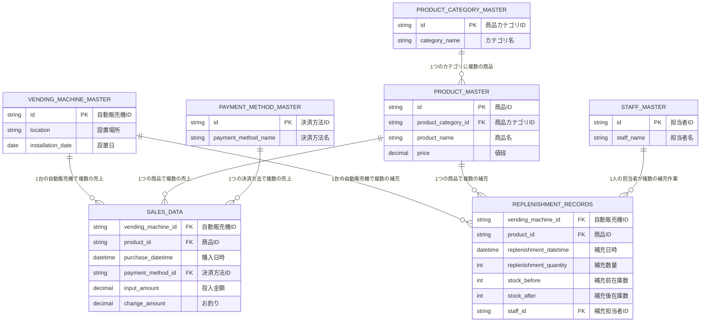

# 生データスキーマ設計書

## 概要

本ドキュメントは、my_claude_doc_investigationプロジェクトで使用する生データのスキーマ定義を記載しています。自動販売機事業のデータを対象とし、売上トランザクション、自動販売機マスタ、商品マスタ、商品カテゴリマスタ、商品補充記録、担当者マスタ、決済方法マスタの各データソースについて詳述します。

## データソース一覧

### マスタデータ

#### 1. 自動販売機マスタデータ（Vending Machine Master）

#### ファイル構造・更新方式
- **ファイル形式**: CSV
- **更新頻度**: 毎日
- **更新方式**: 外部システムから上書きアップロード
- **配置場所**: ソースデータ保存場所

#### スキーマ定義
| 列名 | データ型 | 必須 | 説明 |
|------|----------|------|------|
| id | 文字列 | ✅ | 自動販売機を識別する一意ID（主キー） |
| 設置場所 | 文字列 | ✅ | 自動販売機の設置場所 |
| 設置日 | 日付型 | ✅ | 自動販売機が設置された日付 |

#### データ例
```csv
id,設置場所,設置日
VM001,東京駅構内1F,2023-01-15
VM002,新宿駅西口,2023-02-20
VM003,渋谷スクランブル交差点前,2023-03-10
```

#### 2. 商品マスタデータ（Product Master）

#### ファイル構造・更新方式
- **ファイル形式**: CSV
- **更新頻度**: 毎日
- **更新方式**: 外部システムからアップロード
- **配置場所**: ソースデータ保存場所

#### スキーマ定義
| 列名 | データ型 | 必須 | 説明 |
|------|----------|------|------|
| id | 文字列 | ✅ | 商品を識別する一意ID（主キー） |
| 商品カテゴリid | 文字列 | ✅ | 商品カテゴリの識別ID |
| 商品名 | 文字列 | ✅ | 商品の名称 |
| 値段 | 金額型 | ✅ | 商品の販売価格 |

#### データ例
```csv
id,商品カテゴリid,商品名,値段
PRD001,CAT001,コカ・コーラ,150
PRD002,CAT001,ペプシコーラ,150
PRD003,CAT002,緑茶,130
PRD004,CAT003,ブラックコーヒー,120
```

#### 3. 商品カテゴリマスタデータ（Product Category Master）

#### ファイル構造・更新方式
- **ファイル形式**: CSV
- **更新頻度**: 毎日
- **更新方式**: 外部システムからアップロード
- **配置場所**: ソースデータ保存場所

#### スキーマ定義
| 列名 | データ型 | 必須 | 説明 |
|------|----------|------|------|
| id | 文字列 | ✅ | 商品カテゴリを識別する一意ID（主キー） |
| カテゴリ名 | 文字列 | ✅ | 商品カテゴリの名称 |

#### データ例
```csv
id,カテゴリ名
CAT001,炭酸飲料
CAT002,お茶類
CAT003,コーヒー類
CAT004,果汁飲料
CAT005,スポーツドリンク
```

#### 4. 担当者マスタデータ（Staff Master）

#### ファイル構造・更新方式
- **ファイル形式**: CSV
- **更新頻度**: 毎日
- **更新方式**: 外部システムから上書きアップロード
- **配置場所**: ソースデータ保存場所

#### スキーマ定義
| 列名 | データ型 | 必須 | 説明 |
|------|----------|------|------|
| id | 文字列 | ✅ | 担当者を識別する一意ID（主キー） |
| 担当者名 | 文字列 | ✅ | 担当者の氏名 |

#### データ例
```csv
id,担当者名
EMP001,田中太郎
EMP002,佐藤花子
EMP003,山田次郎
EMP004,鈴木美咲
```

#### 5. 決済方法マスタデータ（Payment Method Master）

#### ファイル構造・更新方式
- **ファイル形式**: CSV
- **更新頻度**: 毎日
- **更新方式**: 外部システムから上書きアップロード
- **配置場所**: ソースデータ保存場所

#### スキーマ定義
| 列名 | データ型 | 必須 | 説明 |
|------|----------|------|------|
| id | 文字列 | ✅ | 決済方法を識別する一意ID（主キー） |
| 決済方法名 | 文字列 | ✅ | 決済方法の名称 |

#### データ例
```csv
id,決済方法名
CASH,現金
IC_CARD,ICカード
CREDIT_CARD,クレジットカード
QR_CODE,QRコード決済
E_MONEY,電子マネー
```

### トランザクションデータ

#### 1. 売上データ（Sales Data）

#### ファイル構造・更新方式
- **ファイル形式**: CSV
- **ファイル命名規則**: `sales_(自動販売機id)_(購入日).csv`
- **分割単位**: 自動販売機ID × 購入日（yyyymmdd形式）
- **更新頻度**: 毎日
- **更新方式**: 外部システムからアップロード
- **配置場所**: ソースデータ保存場所

#### ファイル命名例
```
sales_VM001_20240315.csv
sales_VM002_20240315.csv
sales_VM001_20240316.csv
sales_VM003_20240315.csv
```

#### スキーマ定義
| 列名 | データ型 | 必須 | 説明 |
|------|----------|------|------|
| 自動販売機id | 文字列 | ✅ | 自動販売機を識別する一意ID |
| 商品id | 文字列 | ✅ | 販売された商品の識別ID |
| 購入日時 | 日時型 | ✅ | 商品が購入された日時 |
| 決済方法id | 文字列 | ✅ | 使用された決済方法の識別ID |
| 投入金額 | 数値型 | ✅ | 顧客が投入した金額 |
| お釣り | 数値型 | ✅ | 顧客に返却されたお釣り金額 |

#### データ例
```csv
自動販売機id,商品id,購入日時,決済方法id,投入金額,お釣り
VM001,PRD001,2024-03-15 09:30:00,CASH,200,50
VM001,PRD002,2024-03-15 10:15:00,IC_CARD,0,0
VM001,PRD001,2024-03-15 11:45:00,CASH,500,350
```

#### 2. 商品補充記録データ（Replenishment Records）

#### ファイル構造・更新方式
- **ファイル形式**: CSV
- **ファイル命名規則**: `replenishment_records_(自動販売機id)_(日付).csv`
- **分割単位**: 自動販売機ID × 日付（yyyymmdd形式）
- **更新頻度**: 毎日
- **更新方式**: 外部システムからアップロード
- **配置場所**: ソースデータ保存場所

#### ファイル命名例
```
replenishment_records_VM001_20240315.csv
replenishment_records_VM002_20240315.csv
replenishment_records_VM001_20240316.csv
```

#### スキーマ定義
| 列名 | データ型 | 必須 | 説明 |
|------|----------|------|------|
| 自動販売機id | 文字列 | ✅ | 補充対象の自動販売機ID（外部キー） |
| 商品id | 文字列 | ✅ | 補充した商品のID（外部キー） |
| 補充日時 | 日時型 | ✅ | 商品を補充した日時 |
| 補充数量 | 数値型 | ✅ | 補充した商品の個数 |
| 補充前在庫数 | 数値型 | ⚪ | 補充作業前の在庫数量 |
| 補充後在庫数 | 数値型 | ⚪ | 補充作業後の在庫数量 |
| 補充担当者id | 文字列 | ⚪ | 補充作業を行った担当者のID |

#### データ例
```csv
自動販売機id,商品id,補充日時,補充数量,補充前在庫数,補充後在庫数,補充担当者id
VM001,PRD001,2024-03-15 08:30:00,20,5,25,EMP001
VM001,PRD002,2024-03-15 08:35:00,15,3,18,EMP001
VM002,PRD001,2024-03-15 09:15:00,25,0,25,EMP002
VM001,PRD003,2024-03-15 14:20:00,18,8,26,EMP003
```

## データ関係性

### エンティティ関係図（概念レベル）



### 外部キー関係
- `売上データ.自動販売機id` → `自動販売機マスタ.id`
- `売上データ.商品id` → `商品マスタ.id`
- `売上データ.決済方法id` → `決済方法マスタ.id`
- `商品マスタ.商品カテゴリid` → `商品カテゴリマスタ.id`
- `商品補充記録.自動販売機id` → `自動販売機マスタ.id`
- `商品補充記録.商品id` → `商品マスタ.id`
- `商品補充記録.補充担当者id` → `担当者マスタ.id`

## データ品質に関する考慮事項

### 予想される課題

#### 売上データ
- **ファイル欠損**: 自動販売機の通信障害によるファイル未送信
- **重複レコード**: 同一取引の重複送信
- **日時の不整合**: ファイル名の日付と購入日時の不一致
- **金額の不整合**: `投入金額 - お釣り` と `商品価格` の不一致

#### 自動販売機マスタ
- **ID重複**: 同一IDの複数レコード
- **設置日の不正**: 未来日や異常な過去日
- **設置場所の非標準化**: 表記ゆれや空文字

#### 商品マスタ
- **価格変動**: 同一商品IDでの価格変更への対応
- **カテゴリの整合性**: 存在しない商品カテゴリIDの参照
- **商品名の重複**: 異なるIDで同一商品名

#### 商品カテゴリマスタ
- **カテゴリ名の標準化**: 表記ゆれや略称の統一
- **カテゴリの階層管理**: 将来的な階層化への対応
- **削除されたカテゴリ**: 商品マスタで参照中のカテゴリ削除

#### 商品補充記録
- **在庫数の整合性**: 補充前在庫数 + 補充数量 = 補充後在庫数
- **負の在庫**: 補充前在庫数が負の値
- **異常な補充数量**: 極端に大きいまたは小さい補充数量
- **時系列の整合性**: 同一商品・自動販売機での補充タイミング重複

#### 担当者マスタ
- **担当者名の重複**: 異なるIDで同一担当者名
- **名前の表記ゆれ**: 漢字・ひらがな・カタカナの混在
- **削除された担当者**: 補充記録で参照中の担当者削除

#### 決済方法マスタ
- **決済方法名の標準化**: 表記ゆれや略称の統一
- **削除された決済方法**: 売上データで参照中の決済方法削除
- **新しい決済方法**: システム追加前の決済方法ID参照

### データ品質チェック項目
1. **必須項目のNULLチェック**
2. **数値項目の範囲チェック**（負値、異常値）
3. **日時項目の妥当性チェック**
4. **外部キー整合性チェック**
5. **重複レコードの検出**

## データ取り込み方針

### ファイル監視
- 新規ファイルの自動検出
- ファイル命名規則の検証
- ファイルサイズ・形式の事前チェック

### エラーハンドリング
- 不正データの隔離
- エラーレコードの追跡
- 再処理機能の提供

### 履歴管理
- 原始データの保存
- 処理履歴の記録
- バックアップとアーカイブ

---

**最終更新日**: 2024年8月24日  
**バージョン**: 1.0  
**承認者**: プロジェクトチーム